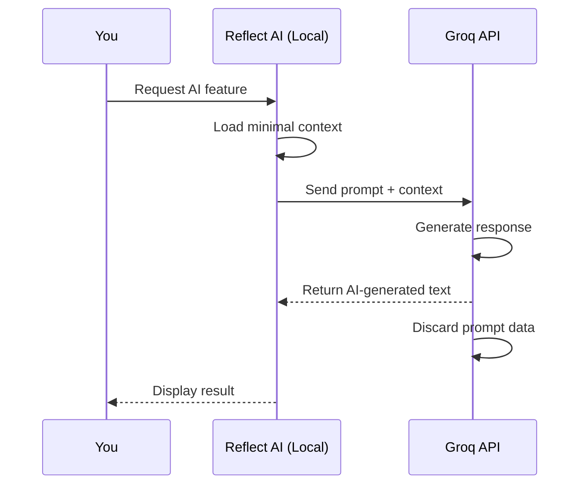

## What is Groq?

Groq powers the AI features in Reflect AI, including:

- Personalized greetings
- Weekly and monthly summaries
- Writing suggestions
- Entry rewriting
- Entry generation from quick notes

## Privacy-First AI

<Info>
  **AI features are entirely optional.** Reflect AI works fully without a Groq API key. Sentiment analysis runs locally using NLTK/VADER.
</Info>

## What Gets Sent to Groq?

When you use AI features, only the **specific content needed** is sent:

### Greeting Generation
- Your total entry count
- Current streak
- Recent mood summary (e.g., "mostly positive")
- Recent themes (e.g., "work, health")
- **NOT sent**: Full entry text

### Weekly/Monthly Summaries
- Preview of recent entries (first 100-300 characters)
- Detected mood labels
- Detected themes and activities
- Pattern insights
- **NOT sent**: Your complete entry text

### Writing Features
- The specific text you want to rewrite/expand
- Context from recent entry previews (optional)
- **NOT sent**: Your entire journal history

## What Groq Does NOT Store

<Warning>
  According to Groq's API terms, prompts sent via API **are not used to train models** and are **not retained** after processing.
</Warning>

Groq processes your data to generate responses, then discards it. They do not:

❌ Store your journal entries  
❌ Use your data for AI training  
❌ Share your data with third parties  
❌ Build a profile on you  

However, you should review [Groq's privacy policy](https://groq.com/privacy-policy/) for the most current information.

## API Key Setup

Your Groq API key is stored in a `.env` file on your device:

```bash
GROQ_API_KEY=your_api_key_here
```

### Getting a Free API Key

1. Visit [console.groq.com](https://console.groq.com)
2. Create a free account
3. Generate an API key
4. Add it to your `.env` file

<Info>
  Groq offers a generous free tier. No credit card required.
</Info>

## How AI Features Work

Here's the data flow:



## Data Minimization

Reflect AI follows a **data minimization principle** when using AI:

1. **Only send what's needed**: Previews, not full text
2. **Aggregate when possible**: "mostly positive" instead of full sentiment data
3. **You control when**: AI features are opt-in per use
4. **Fallback available**: App works without API key

## Model Used

Reflect AI uses the `llama-3.1-8b-instant` model via Groq.

<Info>
  This is a fast, open-source model that provides quality results for journaling features.
</Info>

## Security Recommendations

### Protect Your API Key

<Warning>
  Your API key provides access to your Groq account. Keep it secure.
</Warning>

- Store in `.env` file (not tracked by git)
- Don't share your API key
- Regenerate if compromised
- Monitor usage on Groq dashboard

### Disable AI Features

To completely disable AI features:

1. Remove the `GROQ_API_KEY` from your `.env` file
2. Restart the app

The app will fall back to local-only features:

- Sentiment analysis (NLTK VADER - fully local)
- Theme detection (keyword-based - fully local)
- Activity correlation (pattern matching - fully local)
- Stats and charts (computed locally)

## Privacy Implications

<CardGroup cols={2}>
  <Card title="Local-Only Features" icon="lock">
    No data leaves your device
    - Sentiment analysis
    - Theme detection
    - Streak tracking
    - Charts and stats
  </Card>
  
  <Card title="AI Features" icon="cloud">
    Minimal data sent to Groq
    - Greetings (metadata only)
    - Summaries (previews)
    - Writing help (selected text)
    - Not retained after processing
  </Card>
</CardGroup>

## Transparency

When an AI feature is used, the app indicates it in the response:

```json
{
  "message": "Your personalized greeting...",
  "ai_generated": true
}
```

You always know when AI was involved.

## Questions?

### Can Groq employees read my journal?

No. API requests are processed programmatically and not viewed by humans. Groq does not retain prompt data after processing.

### What if Groq changes their policy?

Reflect AI is designed to work without AI features. You can disable Groq integration at any time and continue using the app.

### Can I use a different AI provider?

Currently, only Groq is supported. However, the code is open-source and can be modified to use other providers (OpenAI, Anthropic, local models, etc.).

### Does local AI work?

You could modify the code to use local models (Ollama, llamafile) for complete offline AI. This would require code changes but is technically possible.

## Best Practices

1. **Review prompts**: Check what data is sent before using AI features
2. **Use selectively**: AI features are optional; use them when beneficial
3. **Trust but verify**: Review AI-generated content before using it
4. **Stay informed**: Monitor Groq's privacy policy for changes
5. **Local when possible**: Prefer local features for maximum privacy

## Summary

<Check>
  Groq integration is **privacy-conscious by design**:
  - Optional, not required
  - Minimal data sent
  - Not retained after processing
  - Transparent when used
  - Full control to disable
</Check>